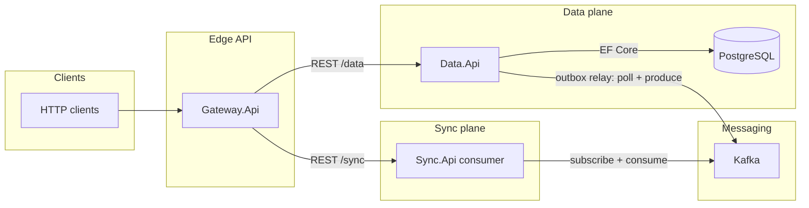

# Airgap sync platform — system architecture

This repository implements a small **air-gap–style sync platform** in .NET. Clients talk to an **API gateway**. The **data service** owns PostgreSQL, domain data, the **transactional outbox**, and **publishes** outbox messages to Kafka. The **sync service** is a **Kafka consumer** that ingests those events (representing the downstream / receiving side; you can extend it to apply changes elsewhere).

## High-level diagram



## Write path and outbox

1. A client creates data through the gateway (`POST /api/data`), which forwards to the data service (`POST /data`).
2. The data service persists a **data row** and an **outbox message** in the **same database transaction** (transactional outbox).
3. The **data service** background publisher claims unprocessed outbox rows, **produces** JSON envelopes to Kafka, then sets **`processed_at_utc`** only after a successful produce.
4. The **sync service** **consumes** from the same topic (consumer group `sync-service` by default) and can forward or apply work on the other side of an air gap.

Internal ops on the data service: **`GET/POST /publish/status|trigger`** (outbox backlog + publisher wake). The gateway does not expose these by default.

## Projects

| Project | Role |
|--------|------|
| `services/gateway/Gateway.Api` | Public HTTP API; forwards to data and sync services. |
| `services/data/Data.Api` | REST API for data; PostgreSQL + EF Core; outbox writer; **Kafka producer** (outbox relay). |
| `services/sync/Sync.Api` | **Kafka consumer**; `GET /sync/status`, `POST /sync/trigger`. |
| `services/shared/Airgap.Persistence` | Shared EF Core `AppDbContext`, entities, outbox table name. |

## Infrastructure (Docker Compose)

- **postgres**: primary database for data and outbox tables.
- **kafka** + **zookeeper**: event bus for outbox envelopes.
- **redis**: available for future caching or rate limiting (not wired in code yet).

## Kafka message shape

Each message value is JSON roughly like:

```json
{
  "outboxId": 1,
  "aggregateType": "DataRecord",
  "aggregateId": "…",
  "eventType": "DataRecordCreated",
  "payload": { "id": "…", "name": "…", "value": "…", "clientRequestId": null, "createdAtUtc": "…" },
  "createdAtUtc": "…"
}
```

## Solution file

Build and open **`Airgap.SyncPlatform.slnx`** at the repository root.
