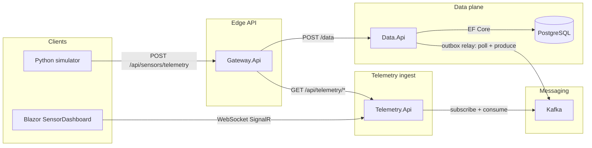

# Airgap sync platform — system architecture

This repository implements a small **air-gap–style sync platform** in .NET. The **telemetry ingest** service (formerly “sync”) is the **Kafka consumer** on the downstream side; it **streams** decoded sensor events to **Blazor** clients over **SignalR**.

## Naming

- **`Telemetry.Api` / `telemetry-service` (Docker)** — Kafka consumer + **SignalR** hub (`/hubs/telemetry`). A good mental name: **telemetry ingest** or **downstream ingest**.
- **`clients/SensorDashboard`** — Blazor WebAssembly UI that subscribes to the hub for live rows.

## High-level diagram

## Sensor path

1. **Simulator** (or any client) posts `POST {gateway}/api/sensors/telemetry` with `deviceId`, `metric`, `value`, `unit`, optional `recordedAt` / `clientRequestId`.
2. Gateway maps that to the existing **`CreateDataRequest`** (`name` = device id, `value` = JSON of metric fields) and calls the data service.
3. Data service writes **`data_records`** + **`outbox_messages`** in one transaction; the in-process publisher sends envelopes to Kafka and marks `processed_at_utc`.
4. **Telemetry.Api** consumes the topic, parses **`DataRecordCreated`** payloads into **`StreamedSensorReading`**, and **`Clients.All.SendAsync("SensorReading", …)`**.
5. **SensorDashboard** connects to **`http://localhost:5051/hubs/telemetry`** (see `wwwroot/appsettings.json`; Docker publishes **5051 → 8080**).

Run the Blazor app with the **http** profile so the browser is not **https** while the hub is **http** (avoids mixed-content blocking):

`dotnet run --project clients/SensorDashboard/SensorDashboard.csproj --launch-profile http`

## Projects

| Project | Role |
|--------|------|
| `services/gateway/Gateway.Api` | `POST /api/sensors/telemetry`, `GET /api/telemetry/status`, `POST /api/telemetry/trigger`, etc. |
| `services/data/Data.Api` | REST `/data`, PostgreSQL, outbox, Kafka **producer**. |
| `services/telemetry/Telemetry.Api` | Kafka **consumer**, SignalR hub, `GET /telemetry/status`. |
| `services/shared/Airgap.Persistence` | EF Core models + `AppDbContext`. |
| `clients/SensorDashboard` | Blazor WASM live table via SignalR. |
| `scripts/simulate_sensors.py` | Optional load generator. |

## Infrastructure (Docker Compose)

- **telemetry-service**: image from `services/telemetry/Telemetry.Api`; port **5051** for browser + Blazor.
- **postgres**, **kafka**, **zookeeper**, **redis** as before.

## Solution file

**`Airgap.SyncPlatform.slnx`** at the repository root.
